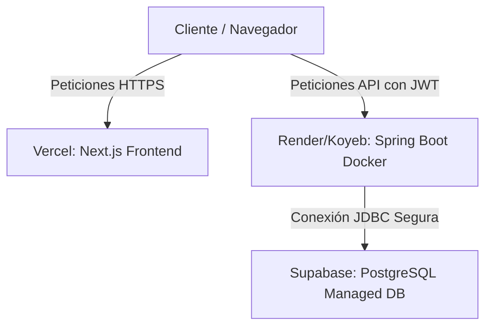

# Guía de Despliegue de Producción - WorkSync

Esta guía detalla los pasos para desplegar la arquitectura completa de la aplicación **WorkSync** en entornos de producción gratuitos y estables:
* **Base de Datos (PostgreSQL):** Alojada en **Supabase**.
* **Backend (Spring Boot API):** Alojado en **Render** (o **Koyeb**) mediante **Docker**.
* **Frontend (Next.js):** Alojado en **Vercel**.

---

## 🗺️ Arquitectura de Despliegue



---

## 1. Base de Datos en Supabase (PostgreSQL)

Supabase provee un motor de base de datos PostgreSQL administrado 100% gratuito, ideal para conectar nuestra API de Spring Boot.

### Pasos:
1. Regístrate en [Supabase.com](https://supabase.com/) usando tu cuenta de GitHub.
2. Crea un **Nuevo Proyecto** (ej. `worksync-prod`).
3. Define y guarda de forma segura la **Contraseña de la Base de Datos**.
4. Una vez creado el proyecto, ve al menú lateral izquierdo y selecciona **SQL Editor** -> **New Query**.
5. Copia el contenido del archivo local [estructura.sql](file:///home/natsu/Documents/APF2%20DWIntegrado/estructura.sql) (limpio y sin comandos incompatibles de consola).
6. Pega el código en el editor de Supabase y haz click en **Run**. Debería aparecer el mensaje `"Success. No rows returned."` indicando que la estructura de tablas ha sido creada con éxito.
7. Ve a **Project Settings** (icono de engranaje) -> **Database** y copia los siguientes parámetros de conexión:
   * **Host:** ej. `aws-0-us-east-1.pooler.supabase.com`
   * **Database Name:** `postgres`
   * **Port:** `5432`
   * **User:** `postgres`

---

## 2. Backend (Spring Boot) en Render (o Koyeb) con Docker

Para evitar problemas de incompatibilidad de versiones de Java o desbordamientos de memoria en los planes gratuitos, desplegaremos la API dentro de un contenedor Docker ligero optimizado para JVM 21.

### Pasos:
1. Asegúrate de que el archivo [Dockerfile](file:///home/natsu/Documents/APF2%20DWIntegrado/backend/Dockerfile) esté en la raíz de tu carpeta `/backend`.
2. Sube los últimos cambios de tu backend a un repositorio en GitHub.
3. Regístrate o inicia sesión en [Render.com](https://render.com/).
4. Crea un **New +** -> **Web Service**.
5. Conecta tu repositorio de GitHub del backend.
6. En la configuración del servicio, establece los siguientes valores:
   * **Root Directory (Directorio Raíz):** `backend` *(si tu repositorio tiene las carpetas backend/frontend separadas. Déjalo en blanco si solo subiste el backend)*.
   * **Runtime (Entorno de Ejecución):** Selecciona **Docker**.
   * **Build Command & Start Command:** Déjalos completamente vacíos (el Dockerfile se encarga de compilar y arrancar la app).
   * **Instance Type:** Asegúrate de elegir **Free** (máquina gratuita).
7. Despliega la sección **Environment Variables** (Variables de Entorno) y añade los siguientes campos con los datos obtenidos de Supabase:
   * `DB_HOST` = *(Host de Supabase)*
   * `DB_PORT` = `5432`
   * `DB_NAME` = `postgres`
   * `DB_USER` = `postgres`
   * `DB_PASSWORD` = *(Contraseña de tu BD de Supabase)*
   * `JWT_SECRET` = *(Una cadena de texto larga de más de 256 bits para firmar los tokens de sesión)*
   * `ALLOWED_ORIGINS` = *(URL de tu frontend en Vercel, ej. https://worksync-frontend.vercel.app)*
8. Haz click en **Create Web Service**. Render descargará la imagen, compilará con Maven y levantará el servidor dándote una URL pública (ej. `https://worksync-backend.onrender.com`).

> [!NOTE]
> El plan gratuito de Render apaga el servidor si transcurren 15 minutos sin peticiones. La primera petición posterior tardará unos 30-40 segundos en responder mientras el contenedor se levanta (se "despierta").

---

## 3. Frontend (Next.js) en Vercel

Vercel compilará la aplicación de Next.js y la distribuirá globalmente de forma gratuita y optimizada.

### Pasos:
1. Sube tu código de `/frontend-nextjs` a tu repositorio en GitHub.
2. Inicia sesión en [Vercel.com](https://vercel.com/) con tu cuenta de GitHub.
3. Haz click en **Add New** -> **Project** e importa tu repositorio del frontend.
4. En el panel de configuración del proyecto, despliega la sección **Environment Variables** y añade:
   * `NEXT_PUBLIC_API_URL` = `https://worksync-backend.onrender.com/api` *(Asegúrate de poner la URL que te dio Render terminando en `/api`)*.
5. Haz click en **Deploy**. Tras un par de minutos, tendrás tu URL de producción activa.

---

## 4. Configuración de Seguridad y CORS

Para que tu aplicación web pueda comunicarse con la API de backend sin que el navegador bloquee las solicitudes, debes asegurarte de que CORS esté configurado para permitir el dominio de Vercel.

### Modificación en el Código del Backend:
En el archivo [WebConfig.java](file:///home/natsu/Documents/APF2%20DWIntegrado/backend/src/main/java/com/worksync/worksync/Config/WebConfig.java), asegúrate de que el backend lea las URLs permitidas dinámicamente desde la variable de entorno `ALLOWED_ORIGINS` que definimos en Render:

```java
@Configuration
public class WebConfig implements WebMvcConfigurer {

    @Value("${allowed.origins:http://localhost:3000}")
    private String allowedOrigins;

    @Override
    public void addCorsMappings(CorsRegistry registry) {
        registry.addMapping("/**")
                .allowedOrigins(allowedOrigins.split(",")) // Separa múltiples orígenes por comas
                .allowedMethods("GET", "POST", "PUT", "DELETE", "OPTIONS")
                .allowedHeaders("*")
                .allowCredentials(true);
    }
}
```
Esto te permite tener configurado `http://localhost:3000` en tu entorno local y la URL de Vercel en producción sin necesidad de alterar tu código cada vez que hagas un despliegue.
